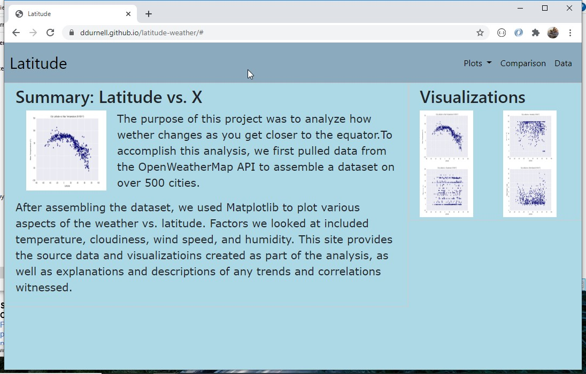
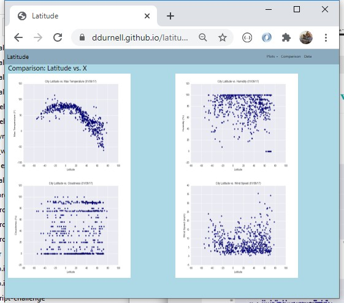
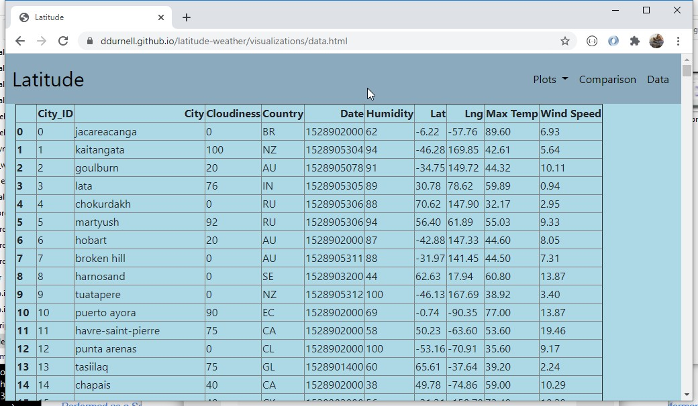
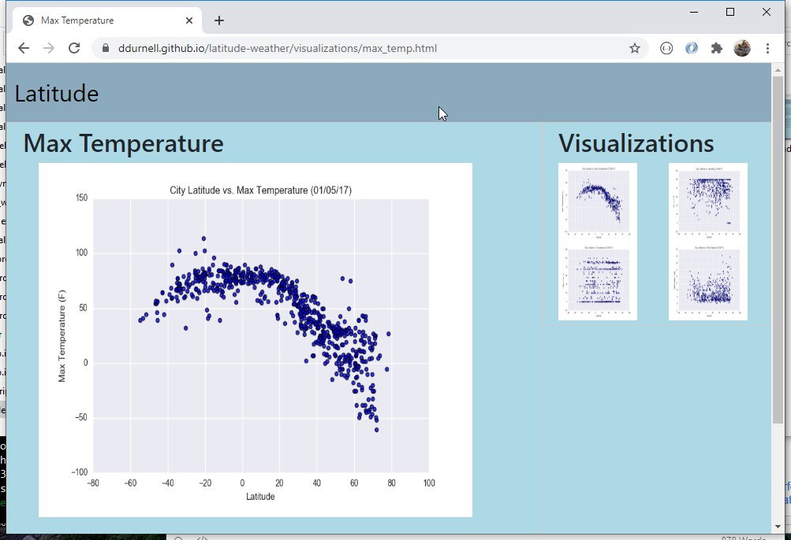
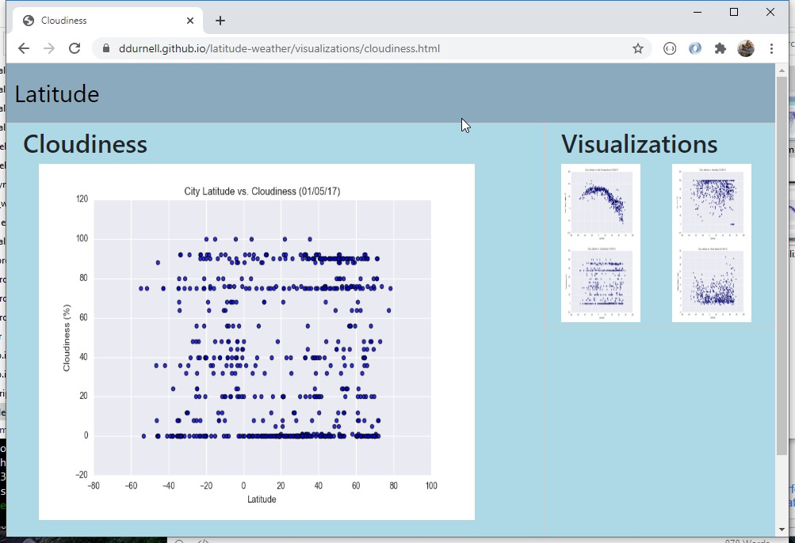
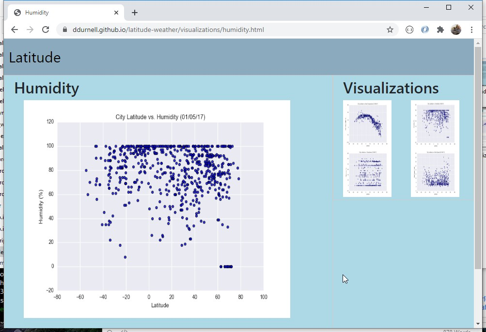

# Latitude Analysis Dashboard

This project creates a visualization dashboard website using provided visualizations. The dashboard contains individual pages for each plot navigation between them. The dashboard contains a landing page, visualizations with explanations, and the data.

### Screenshots

#### Landing page



#### Comparisons page

#### Data page

#### Visualization pages

